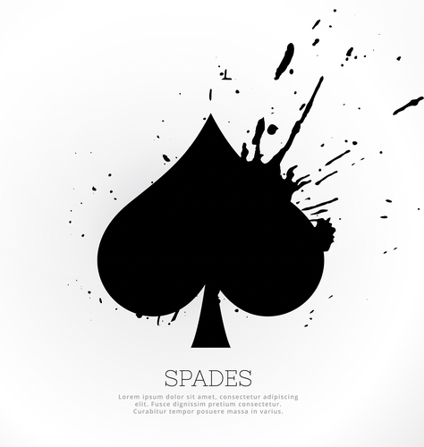
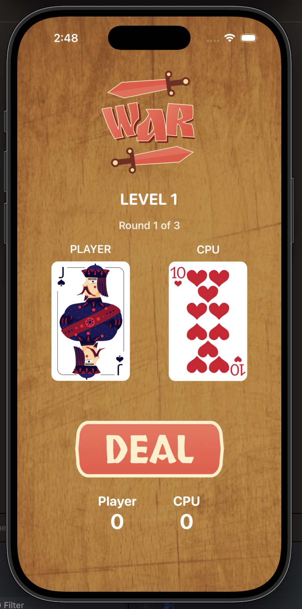
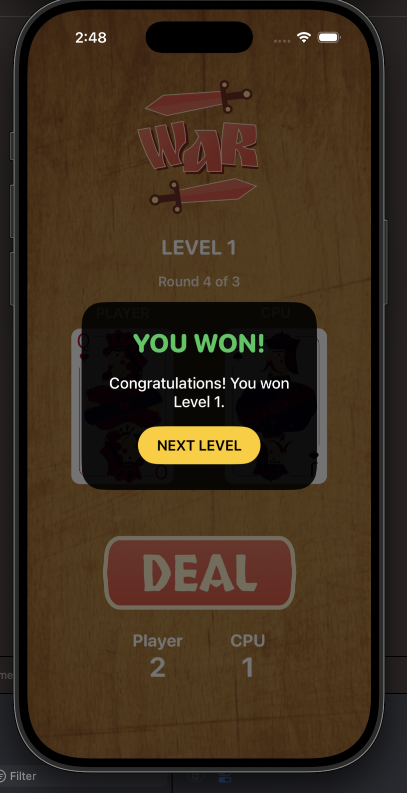

<div align="center">

# ⚔️ War Card Game

### A Fun Card Battle Game built with Swift & UIKit




A simple yet engaging iOS card game where players compete against the CPU by drawing cards across multiple rounds and levels. Built to practice Swift programming, UIKit, game logic, and responsive UI development.

</div>

---

# 🎮 Gameplay

- Draw a card by pressing the **Deal** button.
- The player with the higher card wins the round.
- Win enough rounds to clear the level.
- Advance through increasingly challenging levels.
- Compete against the CPU and improve your score.

---

# ✨ Features

- 🃏 Classic War Card Game
- 🎯 Multi-Level Progression
- 🤖 CPU Opponent
- 🏆 Winner Detection
- 📊 Live Score Tracking
- 🎨 Beautiful Game UI
- ⚡ Smooth Gameplay
- 📱 Optimized for iPhone

---

# 📸 Screenshots

<p align="center">
  
  
</p>

---

# 🛠 Tech Stack

| Category | Technology |
|----------|------------|
| Language | Swift |
| UI Framework | UIKit |
| IDE | Xcode |
| Architecture | MVC |

---

# 📂 Project Structure

```
CardGame
│
├── Assets
├── Models
├── Controllers
├── Views
├── Utilities
└── screenshots
```

---

# 🚀 Getting Started

### Clone the repository

```bash
git clone https://github.com/Veer666/CardGame.git
```

### Open the project

```bash
cd CardGame
open CardGame.xcodeproj
```

Run the project on an iOS Simulator or a physical device using Xcode.

---

# 📱 Requirements

- macOS
- Xcode 16+
- iOS 17+
- Swift 5+

---

# 📚 What I Learned

This project helped me strengthen my understanding of:

- Swift Programming
- UIKit
- Auto Layout
- MVC Architecture
- Randomization
- Game State Management
- User Interface Design
- Score & Level Logic

---

# 🚀 Future Improvements

- 🎵 Sound Effects
- 🔊 Background Music
- 💾 Save Progress
- 🏅 Leaderboard
- 🎲 Difficulty Modes
- 🎨 More Card Themes
- 🌙 Dark Mode
- 👥 Multiplayer Support

---

# 👨‍💻 Author

**Vir Daksh Kumar**

GitHub: https://github.com/Veer666

---

<div align="center">

### ⭐ If you enjoyed this project, consider giving it a star!

Made with ❤️ using Swift & UIKit

</div>
